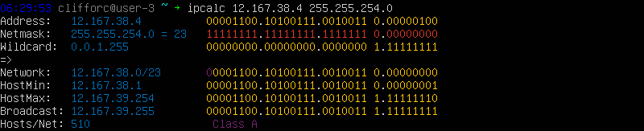
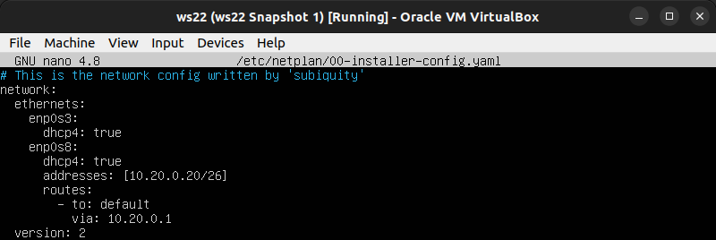
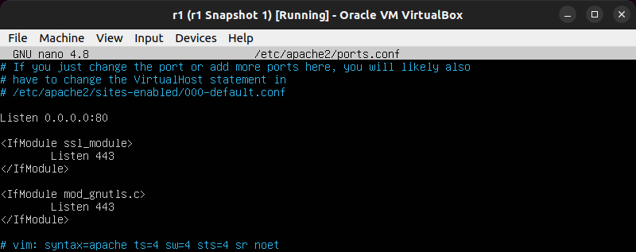
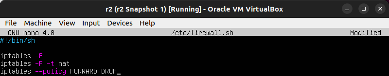
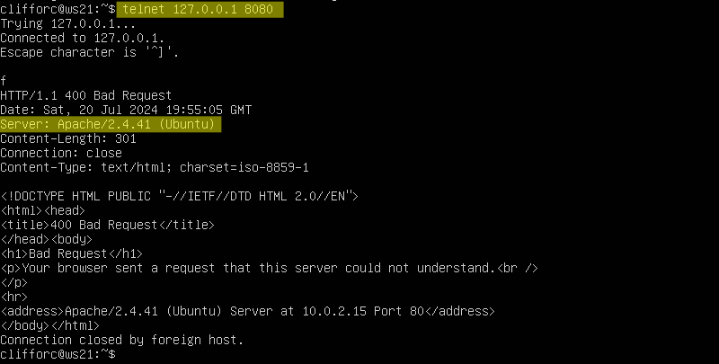

# Настройка сетей в Linux

Этот проект посвящен практическому изучению настройки сетей в операционной системе Linux. Он охватывает различные аспекты сетевого администрирования.

Данный проект является частью образовательной программы [School21](https://21-school.ru/) (образовательный проект от Сбер для разработчиков)

# Содержание

1. [Part 1. Инструмент ipcalc](#part-1-инструмент-ipcalc) 
   1.1. [Сети и маски](#11-сети-и-маски) 
   1.2. [localhost](#12-localhost) 
   1.3. [Диапазоны и сегменты сетей](#13-диапазоны-и-сегменты-сетей)

2. [Part 2. Статическая маршрутизация между двумя машинами](#part-2-статическая-маршрутизация-между-двумя-машинами) 
   2.1. [Добавление статического маршрута вручную](#21-добавление-статического-маршрута-вручную) 
   2.2. [Добавление статического маршрута с сохранением](#22-добавление-статического-маршрута-с-сохранением)

3. [Part 3. Утилита iperf3](#part-3-утилита-iperf3) 
   3.1. [Скорость соединения](#31-скорость-соединения) 
   3.2. [Утилита iperf3](#32-утилита-iperf3)

4. [Part 4. Сетевой экран](#part-4-сетевой-экран) 
   4.1. [Утилита iptables](#41-утилита-iptables) 
   4.2. [Утилита nmap](#42-утилита-nmap)

5. [Part 5. Статическая маршрутизация сети](#part-5-статическая-маршрутизация-сети) 
   5.1. [Настройка адресов машин](#51-настройка-адресов-машин) 
   5.2. [Включение переадресации IP-адресов](#52-включение-переадресации-ip-адресов) 
   5.3. [Установка маршрута по-умолчанию](#53-установка-маршрута-по-умолчанию) 
   5.4. [Добавление статических маршрутов](#54-добавление-статических-маршрутов) 
   5.5. [Построение списка маршрутизаторов](#55-построение-списка-маршрутизаторов) 
   5.6. [Использование протокола ICMP при маршрутизации](#56-использование-протокола-icmp-при-маршрутизации)

6. [Part 6. Динамическая настройка IP с помощью DHCP](#part-6-динамическая-настройка-ip-с-помощью-dhcp)

7. [Part 7. NAT](#part-7-nat)

8. [Part 8. Дополнительно. Знакомство с SSH Tunnels](#part-8-дополнительно-знакомство-с-ssh-tunnels)

## Part 1. Инструмент ipcalc

### 1.1. Сети и маски

- Адрес сети 192.167.38.54/13

- Перевод маски 255.255.255.0 в префиксную и двоичную запись

- Перевод маски /15 в обычную и двоичную

- Перевод маски 11111111.11111111.11111111.11110000 в обычную и префиксную

- Минимальный и максимальный хост в сети 12.167.38.4 при маскe: /8

- Минимальный и максимальный хост в сети 12.167.38.4 при маскe: 11111111.11111111.00000000.00000000

- Минимальный и максимальный хост в сети 12.167.38.4 при маскe: 255.255.254.0

- Минимальный и максимальный хост в сети 12.167.38.4 при маскe: /4

### 1.2. localhost

- 194.34.23.100: Обращение к приложению на localhost невозможно.
- 127.0.0.2: Обращение к приложению на localhost возможно.
- 127.1.0.1: Обращение к приложению на localhost возможно.
- 128.0.0.1: Обращение к приложению на localhost невозможно.

### 1.3. Диапазоны и сегменты сетей

- Частные IP-адреса:
  - 10.0.0.45
  - 192.168.4.2
  - 172.20.250.4
  - 172.16.255.255
  - 10.10.10.10
  

- Публичные IP-адреса:
  - 134.43.0.2
  - 172.0.2.1
  - 192.172.0.1
  - 172.68.0.2
  - 192.169.168.1

- Подходящие IP-адреса для шлюза в сети 10.10.0.0/18:
  - 10.10.0.2
  - 10.10.10.10
  - 10.10.1.255

- Неподходящие IP-адреса для шлюза в сети 10.10.0.0/18:
  - 10.0.0.1
  - 10.10.100.1
  
Диапазон адресов в сети 10.10.0.0/18 от 10.10.0.0 до 10.10.63.255.

## Part 2. Статическая маршрутизация между двумя машинами

- Вывод команды <b>ip a</b> на машине <b>ws1</b>:

- Вывод команды <b>ip a</b> на машине <b>ws2</b>:

- Сетевой интерфейс на обоих машинах <b>enp0s8</b>
- Содержание файла <b>etc/netplan/00-installer-config.yaml</b> на машине <b>ws1</b>:

- Содержание файла <b>etc/netplan/00-installer-config.yaml</b> на машине <b>ws2</b>:

- <b>netplan apply</b> на машине <b>ws1</b>:

- <b>netplan apply</b> на машине <b>ws2</b>:

#### 2.1. Добавление статического маршрута вручную

- Добавление статического маршрута на машине <b>ws1</b>:

- Добавление статического маршрута на машине <b>ws2</b>:

- Проверка связи между машинами:

#### 2.2. Добавление статического маршрута с сохранением

- Содержание файла <b>etc/netplan/00-installer-config.yaml</b> на машине <b>ws1</b>:

- Cодержание файла <b>etc/netplan/00-installer-config.yaml</b> на машине <b>ws2</b>:

- Проверка связи между машинами:

## Part 3. Утилита iperf3

#### 3.1. Скорость соединения

- 8 Mbps = 8 / 8 MB/s = 1 MB/s
- 100 MB/s = 100 * 8 * 1000 Kbps = 800,000 Kbps
- 1 Gbps = 1000 Mbps

#### 3.2. Утилита iperf3

- Запуск сервера iperf3 на машине <b>ws2</b>:

- Запуск клиента iperf3 на машине <b>ws1</b>:

## Part 4. Сетевой экран

#### 4.1. Утилита iptables

- Содержание /etc/firewall на машине <b>ws1</b>:

- Содержание /etc/firewall на машине <b>ws2</b>:

- Запуск комманд <b>chmod +x /etc/firewall.sh</b> и <b>/etc/firewall.sh</b> на машине <b>ws1</b>:

- Запуск комманд <b>chmod +x /etc/firewall.sh</b> и <b>/etc/firewall.sh</b> на машине <b>ws2</b>:

#### Разница между стратегиями
  - <b>Стратегия на ws1:</b> сначала подразумевает запрещающее правило на выход, поэтому она не сможет пропинговать другую машину.
  - <b>Стратегия на ws2:</b> сначала имеет разрешающее правило и затем запрещающее, поэтому она сможет пропинговать другую машину.

#### 4.2. Утилита nmap

- Из машины <b>ws1</b> пингуем машину <b>ws2</b>:

- Из машины <b>ws2</b> пингуем машину <b>ws1</b>:

- Запускаем утилиту <b>nmap</b> на машине <b>ws1</b>:

#### Сохраняем дампы образов виртуальных машин

- Сохраняем образ виртуальной машины <b>ws1</b>:

- Сохраняем образ виртуальной машины <b>ws2</b>:

## Part 5. Статическая маршрутизация сети

#### Поднимаем пять виртуальных машин (3 рабочие станции (ws11, ws21, ws22) и 2 роутера (r1, r2)) и указываем настройки сети как на скриншотах ниже:

- ws11:

- ws21:

- ws22:

- r1:

- r2:

### 5.1. Настройка адресов машин

- Настройка конфигурации в <b>etc/netplan/00-installer-config.yaml</b> на машине <b>r1</b>:

- Настройка конфигурации в <b>etc/netplan/00-installer-config.yaml</b> на машине <b>r2</b>:

- Настройка конфигурации в <b>etc/netplan/00-installer-config.yaml</b> на машине <b>ws11</b>:

- Настройка конфигурации в <b>etc/netplan/00-installer-config.yaml</b> на машине <b>ws21</b>:

- Настройка конфигурации в <b>etc/netplan/00-installer-config.yaml</b> на машине <b>ws22</b>:

- При помощи комманды `sudo neplan apply` перезапускаем сервис сети на всех машинах.
- Проверяем, что адреса настроены правильно при помощи комманды `ip -4 a` на всех машинах:
- r1:
  

- r2:

- ws11:

- ws21:

- ws22:

- Пингуем машины `ws22` и `ws21` межде собой при помощи команды `ping -c 4 10.20.0.10`:

- Пингуем машины `r1` и `ws11` межде собой при помощи команды `ping -c 4 10.10.0.2`:

### 5.2. Включение переадресации IP-адресов

#### Для включения переадресации IP, выполним команду `sudo sysctl -w net.ipv4.ip_forward=1` на роутерах:

- r1:

- r2:

- Внесем данные изменения в <b>/etc/sysctl.conf</b>, чтобы они работали после перезапуска системы:

- r1:

- r2:

### 5.3. Установка маршрута по-умолчанию

#### Настроим маршрут по-умолчанию (шлюз) для рабочих станций.
- Для этого добавим `default` перед IP роутера в файле конфигураций `etc/netplan/00-installer-config.yaml`.

- Далее на каждой машине применим изменения с помощью команды `sudo netplan apply`.
- При помощи команды `ip r` убедимся, что маршрут добавился:

- Для того, чтобы пропинговать роутер `r2` с рабочей станции `ws11` используем команду на `sudo tcpdump -tn -i enp0s8` на роутере `r1`:

- Далее при помощи команды `ping -c 4 10.100.0.12` пропингуем роутер `r2` с рабочей станции `ws11`:

- Провереяем на роутере `r2` что покеты дошли:

### 5.4. Добавление статических маршрутов

- Добавим в роутер `r1` статический маршрут в файл конфигураций `etc/netplan/00-installer-config.yaml`

- Добавим в роутер `r2` статический маршрут в файл конфигураций `etc/netplan/00-installer-config.yaml`

- Проверка маршрутов на роутере `r1` при помощи команды `ip r`:

- Проверка маршрутов на роутере `r2` при помощи команды `ip r`:

- Выполнение команд `ip r list 10.10.0.0/18` и `ip r list 0.0.0.0/0` на машине `ws11`:

### 5.5. Построение списка маршрутизаторов

- Запускаем команду дампа `sudo tcpdump -tnv -i enp0s8` на роутере `r1`
- Строим список маршрутизаторов от `ws11` до `ws21` при помощи команды `traceroute 10.20.0.10` на машине `ws11`:

- Вывод полученный из дампа на роутере `r1`:

#### Вывод traceroute показывает путь от ws11 до 10.20.0.10.

- Маршрут состоит из трех хопов:
  - Шлюз (10.10.0.1)
  - Промежуточный маршрутизатор (10.100.0.12)
  - Конечный пункт назначения (10.20.0.10)

#### Принципы построения пути с использованием traceroute

- Первичная отправка пакетов:
  - `traceroute` отправляет серию пакетов с увеличивающимися значениями `TTL`, начиная с `1`.
  - Первый пакет имеет `TTL = 1` и достигает первого маршрутизатора, который уменьшает `TTL` и возвращает `ICMP` сообщение `Time Exceeded`, когда `TTL` достигает нуля.

- Обнаружение промежуточных хопов:
  - Следующий пакет имеет `TTL = 2` и достигает второго маршрутизатора, который снова уменьшает `TTL` и возвращает `ICMP` сообщение `Time Exceeded`.
  - Этот процесс продолжается с увеличением `TTL` до тех пор, пока пакет не достигнет конечного пункта назначения.
  
- Конечный пункт назначения:
  - Когда пакет достигает конечного пункта назначения, возвращается `ICMP` сообщение `port unreachable`, указывая на конец пути.

- Расчет времени в пути:
  - Временные значения, отображаемые `traceroute`, рассчитываются на основе времени, затраченного на отправку пакета и получение `ICMP` ответа.

- Построение маршрута:
  - Вывод `traceroute` показывает IP-адреса промежуточных маршрутизаторов и время, затраченное на достижение каждого хопа, таким образом, строя маршрут.

#### Объяснение на основе вывода tcpdump

- Вывод `tcpdump` подтверждает наличие `ICMP` пакетов с различными значениями `TTL`, поддерживая описанный выше процесс.
- `ICMP` сообщения `port unreachable` указывают на достижение конечного пункта назначения, подтверждая путь, обнаруженный `traceroute`.

Утилита `traceroute` и вывод `tcpdump` предоставляют дополнительную информацию для построения списка маршрутизаторов на маршруте. `traceroute` идентифицирует каждый хоп и измеряет затраченное время, в то время как `tcpdump` предоставляет детализированный обзор обмена пакетами, подтверждая процесс обнаружения пути.

### 5.6. Использование протокола ICMP при маршрутизации

- Запускаем на `r1` перехват сетевого трафика, проходящего через `enp0s8` с помощью команды `sudo tcpdump -n -i enp0s8 icmp`.
- Пропингуем с `ws11` несуществующий IP (например, 10.30.0.111) с помощью команды `ping -c 1 10.30.0.111`.

- Вывод, полученный из дампа на `r1`:

Сохраняем дампы образов виртуальных машин:

## Part 6. Динамическая настройка IP с помощью DHCP

- Для `r2` настраиваем в файле `/etc/dhcp/dhcpd.conf` конфигурацию службы `DHCP`  
Указываем адрес маршрутизатора по-умолчанию, DNS-сервер и адрес внутренней сети:

- В файле `/etc/resolv.conf` прописываем `nameserver 8.8.8.8`:

- Перезагружаем службу `DHCP` командой `sudo systemctl restart isc-dhcp-server`:

- Включаем динимеческое получение IP-адреса на `ws21` и `ws22` для этого в `/etc/netplan/00-installer-config.yaml` изменяем значение `dhcp4` на `true`:

- Перезагружаем машину `ws21` и при помощи команды `ip a` убеждаемся, что машина получила IP-адрес от `DHCP`:

- Пингуем `ws22` с `ws21`:

- Указываем MAC адрес у `ws11`, для этого в `/etc/netplan/00-installer-config.yaml` добавляем строки: `macaddress: 10:10:10:10:10:BA`, `dhcp4: true`:

- Для `r1` настраиваем в файле `/etc/dhcp/dhcpd.conf` конфигурацию службы `DHCP` так же как и на `r2` и добавляем жесткую привязку к MAC-адресу (ws11):

- В файле `/etc/resolv.conf` прописываем `nameserver 8.8.8.8`:

- Перезагружаем службу `DHCP` командой `sudo systemctl restart isc-dhcp-server`:

- Перезагружаем машину `ws11` и при помощи команды `ip a` убеждаемся, что машина получила IP-адрес от `DHCP`:

#### Процесс обновления IP-адреса на машине `ws21`:

- Получаем текущий IP-адрес:

- Обновляем IP-адрес:
  - При помощи команды `sudo dhclient -r` освобождаем старый IP-адрес;
  - Проверяем что IP-адрес освободился командой `ip a`;
  - При помощи команды `sudo dhclient` получаем новый IP-адрес;
  - Проверяем что IP-адрес обновился командой `ip a`.

- Сохраняем дампы образов виртуальных машин:

## Part 7. NAT

- В файле `/etc/apache2/ports.conf` на `ws22` и `r1` изменяем строку `Listen 80` на `Listen 0.0.0.0:80`, то есть сделай сервер Apache2 общедоступным:

- Запускаем веб-сервер `Apache` командой `sudo service apache2 start` на `ws22` и `r1`:

- Добавляем в фаервол `/etc/firewall.sh`, созданный по аналогии с фаерволом из Части 4, на `r2` следующие правила:
1) Удаление правил в таблице filter - `iptables -F`;
2) Удаление правил в таблице "NAT" - `iptables -F -t nat`;
3) Отбрасывать все маршрутизируемые пакеты - `iptables --policy FORWARD DROP`.

- Запускаем файл:

- Проверяем соединение между `ws22` и `r1` командой `ping`, `ws22` не должна «пинговаться» с `r1`:

- Добавляем в файл правило разрешающее маршрутизацию пакетов протокола `ICMP` на `r2`:

- Применяем изменения:

- Проверяем соединение между `ws22` и `r1` командой `ping`, `ws22` должна «пинговаться» с `r1`:

- Включаем `SNAT`, а именно маскирование всех локальных ip из локальной сети, находящейся за `r2` (по обозначениям из Части 5 - сеть `10.20.0.0`);
- Включаем `DNAT` на `8080` порт машины `r2` и добавляем к веб-серверу Apache, запущенному на `ws22`, доступ извне сети:

- Применяем изменения:

- Проверяем соединение по `TCP` для `SNAT`: для этого с `ws22` подключаемся к серверу `Apache` на `r1` командой: `telnet [адрес] [порт]`:

- Проверяем соединение по `TCP` для `DNAT`: для этого с `r1` подключаемся к серверу `Apache` на `ws22` командой `telnet [адрес] [порт]` (обращаться по адресу `r2` и порту `8080`):

- Сохраняем дампы образов виртуальных машин:

## Part 8. Дополнительно. Знакомство с SSH Tunnels

#### Перед выполнением задания убедится, что на машинах `ws11`, `ws21`, `ws22`, `r2` установлен и запущен `openssh-server`;

  - `sudo apt update`;
  - `sudo apt upgrade -y`;
  - `sudo apt install openssh-server -y`;
  - `sudo systemctl start ssh`;
  - `sudo systemctl enable ssh`.
#### Так же проверить установлен ли apache2 на `ws22`.

  - `sudo apt update`;
  - `sudo apt upgrade -y`;
  - `sudo apt install apache2 -y`; 

1. Запускаем на `r2` фаервол с правилами из Части 7:

2. Применяем изменения настрокет firewall:

3. Запускаем веб-сервер `Apache` на `ws22` только на `localhost` (то есть в файле `/etc/apache2/ports.conf` изменяем строку `Listen 80` на `Listen localhost:80`):

4. Запускаем сервер после изменений и проверяем статус:

5. Воспользуемся `Local TCP forwarding` с `ws21` до `ws22`, чтобы получить доступ к веб-серверу на `ws22` с `ws21`:

6. При помощи команды `telnet 127.0.0.1 8080` на машине `ws21` проверяем сработало ли подключение:

7. Воспользуемся Remote TCP forwarding c ws11 до ws22, чтобы получить доступ к веб-серверу на ws22 с ws11:  
   7.1 Для этого для начала создаем промежуточный туннель от `ws11` к `r2`: 

7.2 Затем создаем туннель от `r2` к `ws22`:

7.3 Затем из-за настроек `firewall` на `r2`, которые не пропускает пакеты из другой сети, нам необходимо пробросить тунель от `ws22` к `ws11`;
- Для этого воспользуемся командой `sudo ssh -R 10.10.0.2:8080:localhost:80 clifforc@10.10.0.2`:

- При помощи команды `telnet 127.0.0.1 8080` на машине `ws11` проверяем сработало ли подключение:

8. Сохраняем дампы образов виртуальных машин:

